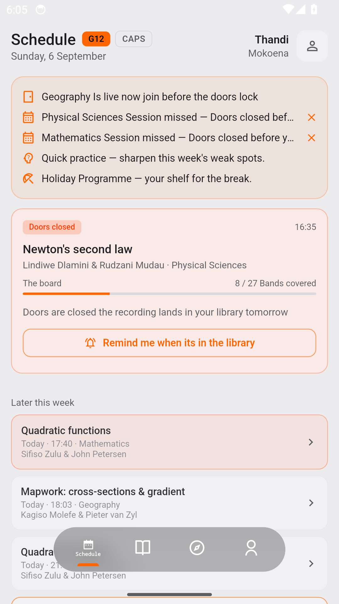
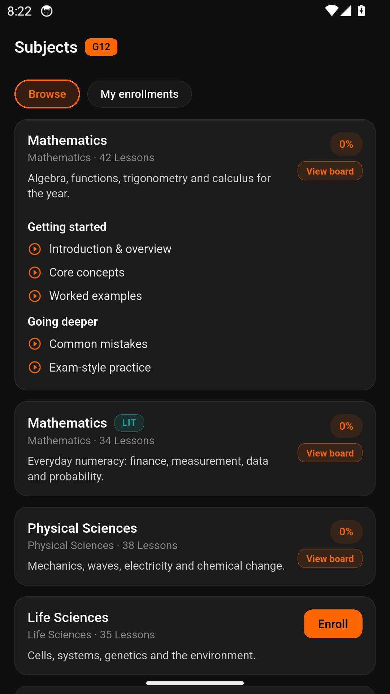
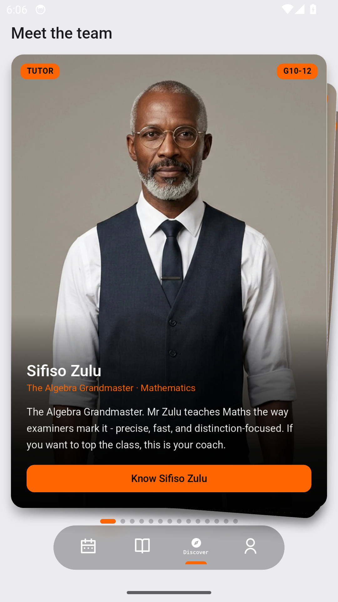
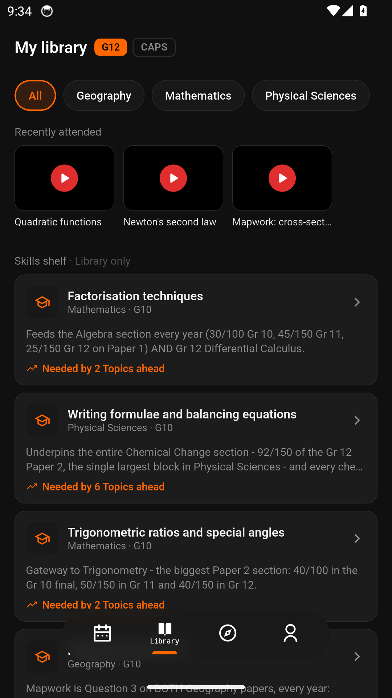
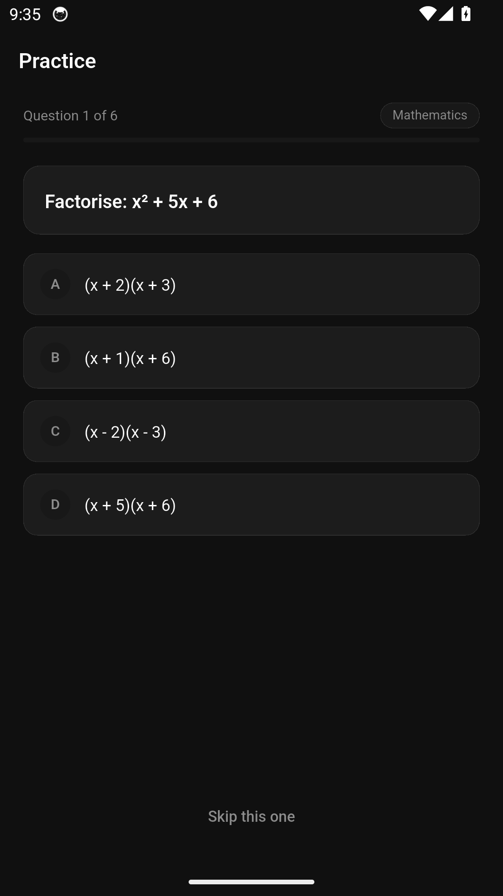
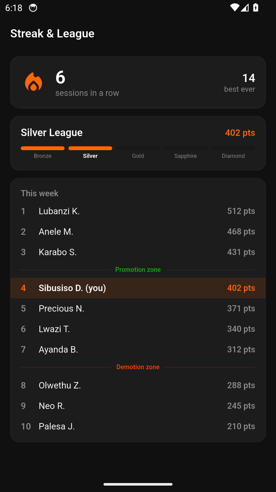
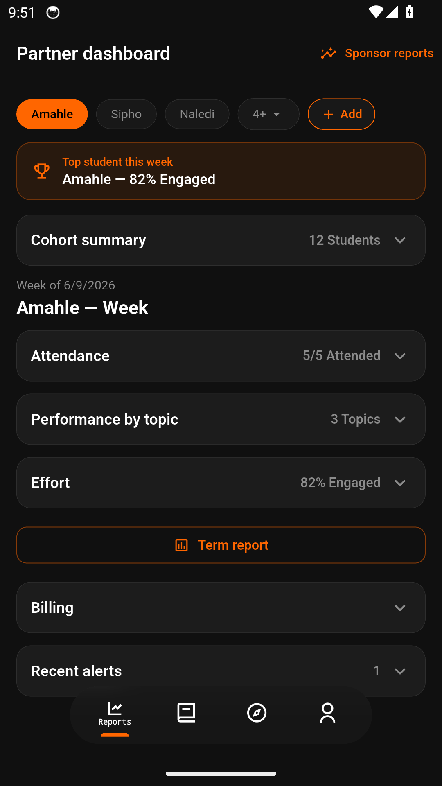

# supacharge

A new Flutter project.

## App tour

Live lessons, tutors, practice and partner reporting — captured straight from the app.

<table>
  <tr>
    <td align="center"><br><sub>Welcome</sub></td>
    <td align="center"><br><sub>Schedule</sub></td>
    <td align="center"><br><sub>Subjects</sub></td>
    <td align="center"><br><sub>Tutors</sub></td>
  </tr>
  <tr>
    <td align="center"><br><sub>Library</sub></td>
    <td align="center"><br><sub>Practice</sub></td>
    <td align="center"><br><sub>Streak &amp; League</sub></td>
    <td align="center"><br><sub>Partner dashboard</sub></td>
  </tr>
</table>

The full tour lives in the [feature guide](marketing/tour/feature-guide.md), with walkthrough videos alongside it in [`marketing/tour/`](marketing/tour).

## Getting Started

This project is a starting point for a Flutter application.

A few resources to get you started if this is your first Flutter project:

- [Lab: Write your first Flutter app](https://docs.flutter.dev/get-started/codelab)
- [Cookbook: Useful Flutter samples](https://docs.flutter.dev/cookbook)

For help getting started with Flutter development, view the
[online documentation](https://docs.flutter.dev/), which offers tutorials,
samples, guidance on mobile development, and a full API reference.

<!-- @generated-recompose-start -->
## Recomposing this app

`lib/` is fully installer-generated and disposable - it is safe to delete
and is gitignored. Anything app-specific lives in tracked manifests
(`app_routes`, or `host_routes` in `composer.json`), never in `lib/` itself.

To regenerate it:

```sh
python3 .rokct/initiate.py   # provisions the composer under .rokct/skills/
python3 .rokct/skills/.rok/flutter/scripts/compose.py
```

Session cleanup (`python3 .rokct/end_protocol.py`) wipes the provisioned
tools again.
<!-- @generated-recompose-end -->
