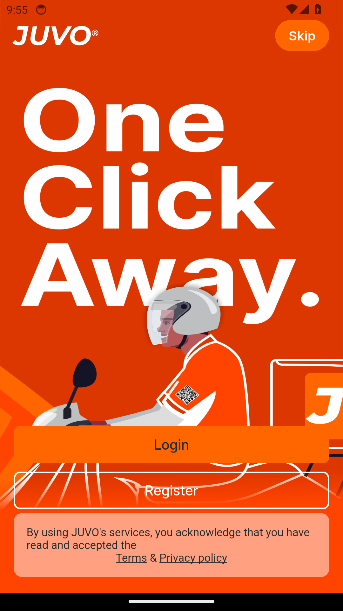
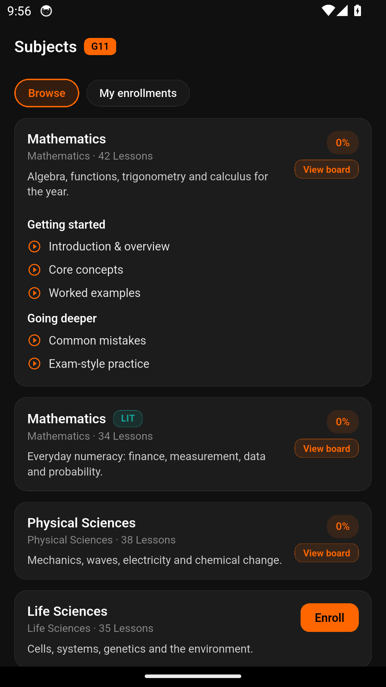
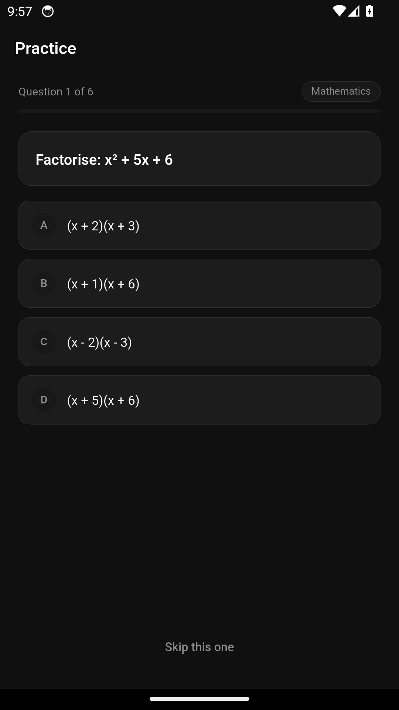
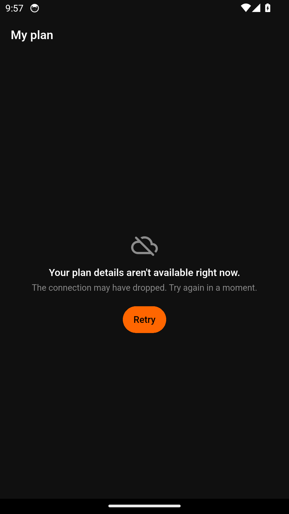
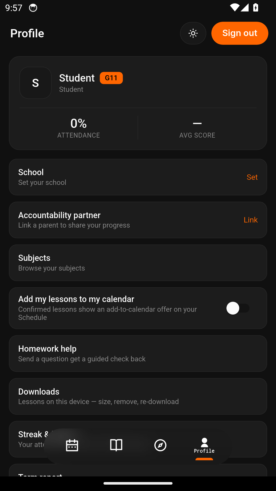

# Supacharge — Feature Guide

Live tutoring that fits around school

> This guide is generated automatically on every merge: CI builds the
> app with its built-in demo dataset, walks the guided tour on an
> Android emulator, and captures each screen below. Content shown is
> demo data.

## 1. Welcome to Supacharge

Supacharge is live tutoring that fits around school - and in this demo build,
any sign-in details work.

## 2. Today, sorted

Your day at a glance - the next live session is always front and centre.

## 3. Courses built on CAPS

Browse CAPS-aligned courses for every subject you take, term by term.

## 4. Meet the tutors

Real tutors teaching live - find the one whose style clicks with you.

## 5. The library keeps everything

Rewatch past lessons and dip into knowledge bites whenever you like.

## 6. Practice makes marks

Sharpen your skills with practice built around your subjects.

## 7. Climb the league

Earn points as you learn and see how you stack up this week.

## 8. One clear plan

See exactly what your plan includes - no surprises.

## 9. Your learning, your profile

Your Supacharge profile tracks your grade, subjects and progress in one place.
