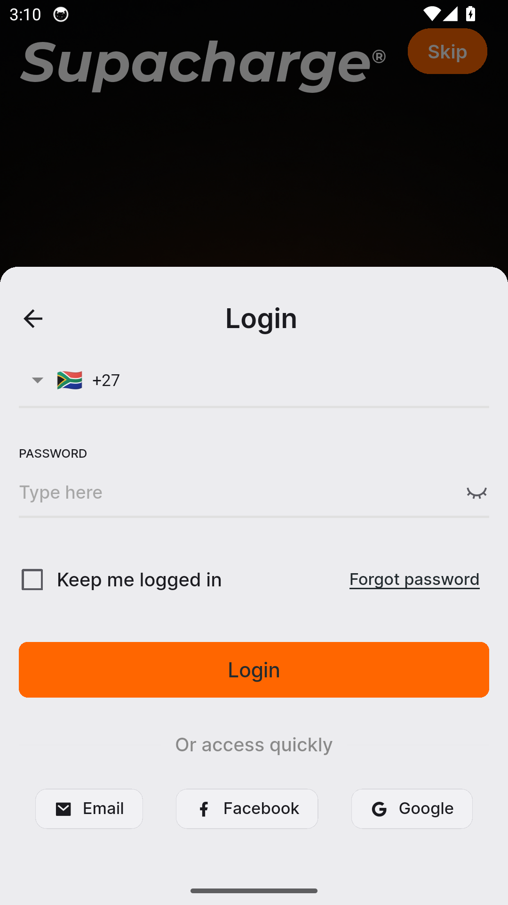
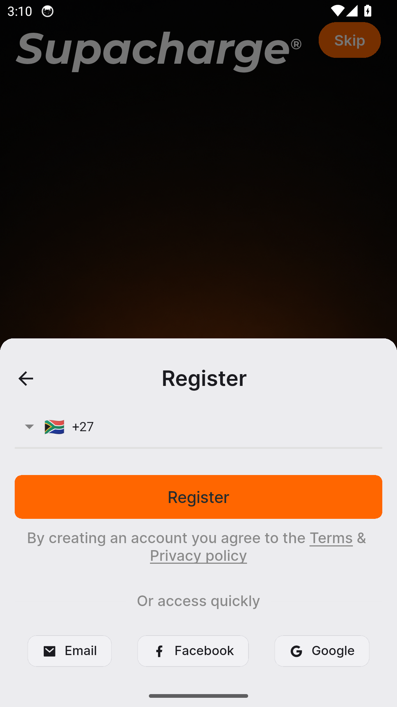
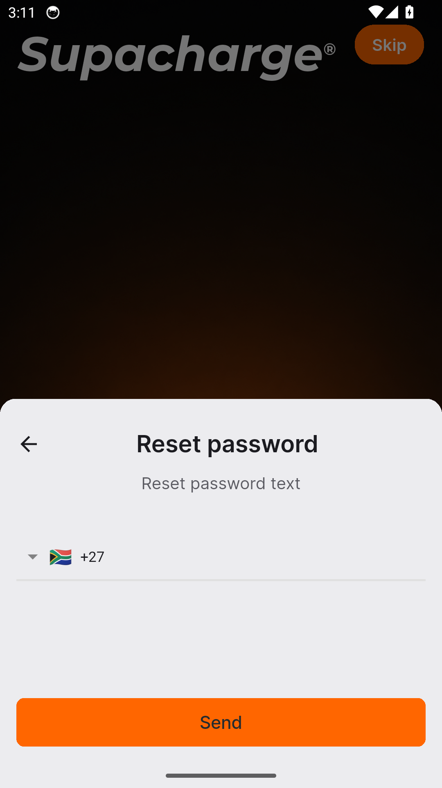

# Supacharge — Feature Guide

Live tutoring that fits around school

> This guide is generated automatically on every merge: CI builds the
> app, walks the guided tour on an Android emulator, and captures
> each screen below.

## 1. Welcome to Supacharge

Supacharge is live tutoring that fits around school - sign in to get started.

## 2. Sign in

Signing in to Supacharge is quick and simple.

## 3. Create an account

New to Supacharge? Create your account in a few easy steps.

## 4. Reset your password

Forgot your password? Supacharge gets you back in with a secure reset.
